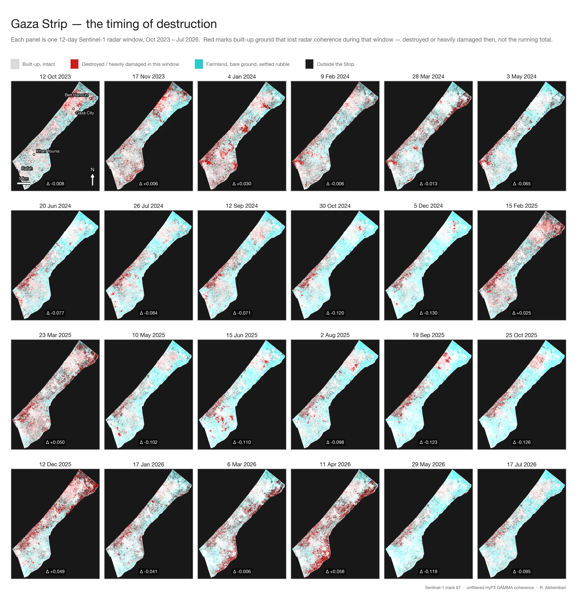
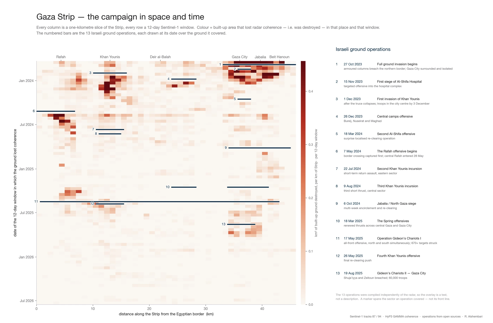
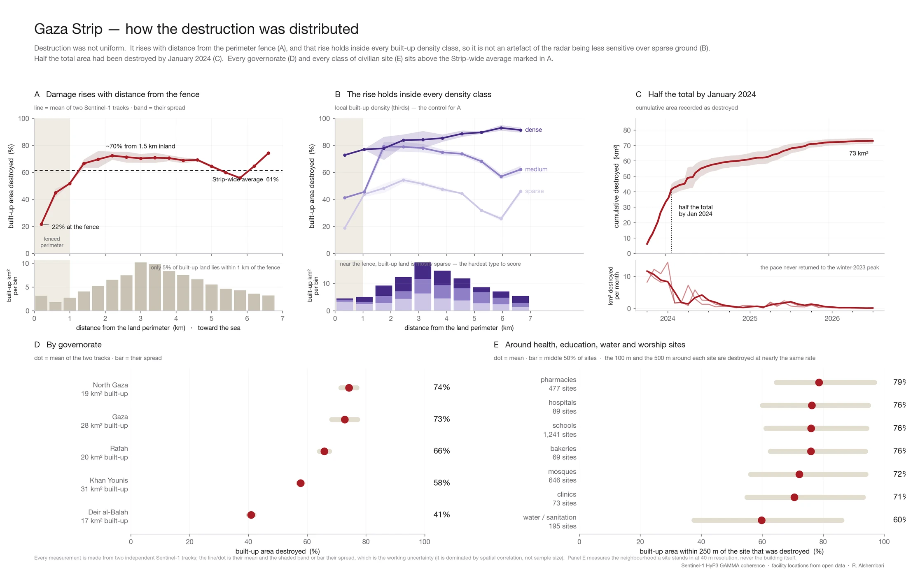
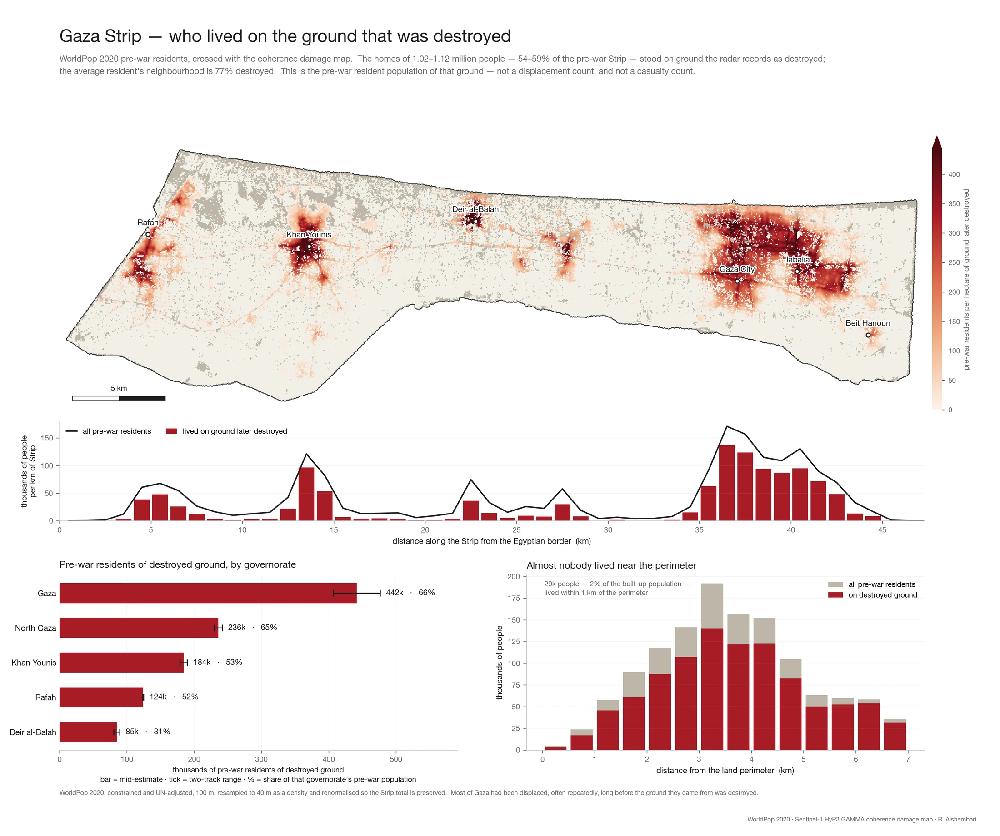

# Mapping the destruction of the Gaza Strip with satellite radar

Web-ready figures and the text to go with them, for publication on a personal
website.

This folder contains four finished figures (each as a small `.webp` for the
page, a `.png` fallback, and a full-resolution `.png` master), the plotting
scripts that produced them, and this document, which explains what each figure
shows, how the underlying measurement was made, and where every input came
from.

---

## 1. Summary

Between October 2023 and mid-2026 a large fraction of the Gaza Strip's built
environment was physically destroyed. This work measures how much, where, and
when, using **satellite radar interferometric coherence** — a physical measure
of whether a patch of ground still scatters radar the way it did before the war.

The measurement is made **twice**, from two independent satellite viewing
geometries, so that every number carries a replication range rather than a
single value. The main results:

| | |
|---|---|
| **Built-up area destroyed** | 61–65 % of the Strip's ~116 km² — that is **71–75 km²**, with **60 km² confirmed independently by both geometries** |
| **Timing** | half of the total was reached within about four months, by late January 2024 |
| **Spatial pattern** | destruction *rises* with distance from the land perimeter fence, and this holds inside every built-up density class |
| **Population** | the destroyed ground was home before the war to **1.0–1.1 million people**, over half the pre-war Strip |
| **Recovery** | in coherence terms the damage signal is *transient* — rubble re-stabilises and the signal fades within a year, so a single "before/after" radar pair would miss most of what happened |

The method has two stated **limits**, reported as prominently as the findings:
per-pixel dating does not replicate between the two geometries (per-kilometre
timing does), and repeat strikes on ground already in ruins cannot be measured.

---

## 2. The figures

### 2.1 The timing of destruction — per 12-day window

**File:** `figures/gaza_s1_perpair_web_2000.webp` (fallback `.png`, master
`gaza_s1_perpair_web.png`)



**What it shows.** Twenty-four panels, each one 12-day Sentinel-1 window from
October 2023 to July 2026. This is a false-colour composite:

- the **red channel** is the *pre-war* average coherence — how reflective and
  stable that ground was before the war, the same in every panel;
- the **green and blue channels** (together they read as **cyan**) are the
  coherence for *that one window only*.

So each pixel mixes a fixed red layer with a per-window cyan layer:

| Colour | Meaning |
|---|---|
| **white / pale grey** | was coherent before the war, still coherent this window — intact |
| **red** | was coherent before the war, *lost* coherence this window — destroyed or heavily damaged in these 12 days |
| **cyan / dark** | low pre-war coherence anyway — farmland, bare ground, sea — so natural change here is not mistaken for damage |

**How to read it.** Because the cyan channel is only that window's coherence —
not a running minimum — **red marks destruction happening in that window, not
the accumulated total.** A block flattened in November 2023 is red in the
November 2023 panel and then fades back to white in 2024, because the rubble
pile itself becomes a stable radar target again. The sequence is a *film of when
the destruction happened* moving through the Strip, not a damage map that only
grows.

The **Δ** under each panel is the change in the Strip-wide average coherence for
that window against the pre-war baseline; negative means net coherence loss.

*Source track: Sentinel-1 track 87 (ascending), unfiltered HyP3 GAMMA
coherence.*

---

### 2.2 The campaign in space and time

**File:** `figures/chronology_A_web_2200.webp` (fallback `.png`, master
`chronology_A_web.png`)



**What it shows.** Every **column** is a one-kilometre slice of the Strip
(measured along its length from the Egyptian border); every **row** is a 12-day
radar window. Colour is the built-up area that lost coherence — i.e. was
destroyed — in that place and that window. The numbered horizontal bars are the
**13 recorded Israeli ground operations**, each drawn at its date over the
ground it covered.

**How to read it.** The operations were compiled from open sources
*independently of the radar*, which makes the overlay a **test**, not a
description: where a coloured band sits directly below an operation bar, the two
records agree. The list beside the chart gives each operation's date and a short
note. A wide vertical smear means the ground in that sector came down gradually;
a tight horizontal band means it came down all at once.

**What it establishes.** Per-*pixel* onset dates do not replicate between the
two radar geometries (only 43 % agree to within one 12-day window), but the
per-*kilometre* chronology does, at r = 0.95. Nothing here is therefore drawn at
per-pixel time resolution. Read against the operation bars, most operations
enter sectors where the coloured destruction bands are already well developed
above them.

---

### 2.3 How the destruction was distributed

**File:** `figures/fig02_web_2200.webp` (fallback `.png`, master
`fig02_web.png`)



Five panels:

- **A — Damage rises with distance from the fence.** Destroyed share of built-up
  area against distance from the land perimeter. It is *low at the fence*
  (~22 %) and rises to a plateau of ~70–75 % from about 1.5 km inland — the
  opposite of the intuitive expectation. The small bar chart below shows the
  *exposure*: only about 5 % of the Strip's built-up land lies within 1 km of
  the fence.
- **B — The rise holds inside every density class.** Built-up land near the
  fence is sparse, and sparse built-up is genuinely harder to score as
  destroyed (a 40 m pixel with two houses among fields keeps most of its
  coherence). This panel re-tests the panel-A gradient *inside* each third of
  local built-up density. The rise survives in all three, so it is not a
  detection artefact.
- **C — Half the total by January 2024.** Cumulative destroyed area over time,
  with the monthly rate below. Most of the destruction is in the first months;
  the pace never returned to the winter-2023 peak.
- **D — By governorate.** Destroyed share of built-up area, North to South:
  North Gaza ~74 %, Gaza ~73 %, Rafah ~66 %, Khan Younis ~58 %, Deir al-Balah
  ~41 %.
- **E — Around civilian sites.** For pharmacies, schools, bakeries, hospitals,
  mosques, clinics and water/sanitation assets, the share of the built-up area
  *within 250 m* of each site that was destroyed (dot = mean, bar = middle 50 %
  of sites). All classes sit at 60–79 %. The 100 m immediately around a site and
  the 500 m around it are destroyed at nearly the same rate — the destruction is
  **neighbourhood-scale**, and this is *not* a building-level assessment of the
  facilities themselves.

**On the two lines/dots per panel:** every measurement is made from two
independent Sentinel-1 tracks. In these figures they are collapsed to one line
(their mean) with a shaded band or bar (their spread). That spread — not the
formal confidence interval, which is dominated by spatial correlation rather
than sample size — is the honest uncertainty.

---

### 2.4 Who lived on the ground that was destroyed

**File:** `figures/population_ADE_web_2200.webp` (fallback `.png`, master
`population_ADE_web.png`)



**What it shows.** The pre-war resident population (WorldPop 2020) crossed with
the coherence damage map.

- **The map** — pre-war residents per hectare *of ground later destroyed*. The
  dark clusters are the dense cores: Gaza City and Jabalia in the north, Khan
  Younis and Rafah in the south.
- **The along-strip profile** — everyone (line) versus those who lived on ground
  later destroyed (bars), per kilometre.
- **By governorate** — thousands of pre-war residents of destroyed ground, with
  the share of each governorate's pre-war population.
- **Perimeter gradient** — almost nobody lived near the fence: about 29 000
  people, 2 % of the built-up population, lived within 1 km of the perimeter.

**What it establishes.** The homes of **1.02–1.12 million people — 54–59 % of
the pre-war Strip** — stood on ground the radar records as destroyed. Because
the destruction fell disproportionately on the *densest* ground, the
population-weighted picture is worse than the area figure: 65 % of the built-up
population lived somewhere now more than three-quarters destroyed, against 44 %
of the built-up area.

**Important:** this is the pre-war *resident population of ground later
destroyed*. It is **not a displacement count and not a casualty count.** Most of
Gaza had been displaced, often repeatedly, long before the ground they came from
was hit.

---

## 3. How the measurement works

### 3.1 Why radar, and why coherence

Optical "before and after" imagery is intuitive and misleading: optical sensors
see cloud and darkness on many days, and what they measure is surface
*brightness*, which changes with season, soil moisture and sun angle. An early
version of this project used an optical time series and abandoned it — the
seasonal swing was larger than the damage signal.

Radar supplies its own illumination, so cloud and night are irrelevant, and
Sentinel-1 has imaged the region on a fixed 12-day repeat cycle since long
before the war, which is what makes a pre-war baseline possible.

The specific quantity used is **interferometric coherence**: the correlation
between two complex radar images of the same ground taken 12 days apart. It
answers a sharp question — *did this ground scatter radar the same way twice?*
Intact structures do, because their geometry is fixed. When a building collapses
the arrangement of scatterers inside the 40 m cell is destroyed and cannot be
recovered, so coherence falls — and it falls for a reason specific to
*structural change*, not to colour, brightness or moisture.

This is why the result is expressed as **destroyed area**, not a building count
or a damage grade: coherence tells you a 40 m cell stopped being what it was,
not how many walls are standing inside it.

### 3.2 Two geometries

Layover and shadow in dense urban terrain depend on the direction the radar
looks from. Damage seen from one look direction and not the other cannot be told
apart from a geometric artefact — unless a second, independent geometry is
processed. Here an **ascending track (87)** and a **descending track (94)** were
run through an identical pipeline. They agree on 60 km² independently, with a
Cohen's κ of 0.535. That is a moderate figure, and reporting it honestly matters
more than reporting a higher one: with most of the built-up area damaged, two
maps agreeing purely by chance would still score ~78 % raw agreement.

### 3.3 A calibrated threshold

"Coherence dropped a lot" is not a measurement until "a lot" has a false-positive
rate. The detection threshold is set from the distribution of the same statistic
computed over **control ground outside the Strip**, at a fixed **5 % false-
positive rate**. Every pixel is also normalised against its own pre-war
statistics, because built-up density in Gaza varies by more than a factor of
ten and a single global threshold would map density rather than damage.

### 3.4 Damage is a transient

Destroyed ground loses about **35 % of its coherence at the moment of collapse
and returns to its pre-war level within a year** — rubble settles, debris stops
moving, cleared ground stabilises, and the surface becomes a reproducible
scatterer again. Damage is therefore a *transient*, not a permanent state. A
single post-war interferogram taken in 2026 would have missed most of what
happened in 2023. This is why a dense stack of ~107 image pairs per track was
necessary, and it is a result that generalises: any coherence-based damage study
built on one before/after pair is undercounting.

*Coherence recovery is re-coherence of settled rubble and cleared ground. It is
**not** evidence of reconstruction — separating those requires radar backscatter
as well and is not attempted here.*

---

## 4. Data sources

| Purpose | Source | Detail |
|---|---|---|
| Radar imagery | **Copernicus Sentinel-1** SLC (IW mode), via the Alaska Satellite Facility (ASF) DAAC | Tracks 87 (ascending) and 94 (descending); 107 image pairs each; acquisitions 9 Jan 2023 – 17 Jul 2026; pre-war baseline = 22 pairs whose second acquisition is on or before 7 Oct 2023 |
| Interferograms | **ASF HyP3**, on-demand, GAMMA workflow | Multilooking 10 × 2 → 40 m ground pixel; temporal baseline held at 11–13 days; **Goldstein phase filter disabled** (it saturates the coherence estimate); no water mask |
| Built-up mask | **Sentinel-2 L2A** (Copernicus), 13 scenes 2023–2026, via AWS Earth Search | Multi-date maximum NDVI, to separate permanent non-vegetated surface from seasonal fallow farmland → 115.8 km² built-up |
| Strip & governorate outlines | **geoBoundaries** gbOpen, PSE ADM1 / ADM2 | Strip area 364.8 km² |
| Population | **WorldPop 2020**, constrained, UN-adjusted, 100 m (`pse_ppp_2020_UNadj_constrained.tif`) | 1,900,522 inside the Strip; resampled to 40 m as a density and renormalised so the Strip total is preserved. The *un*-adjusted product overcounts Palestine by ~13 % against PCBS |
| Population total (2023) | **PCBS** (Palestinian Central Bureau of Statistics) mid-2023 projection | ~2.2 million in the Strip; used only to scale the 2020 counts forward |
| Civilian facilities | oPt health-facility list; **HOTOSM** (Humanitarian OpenStreetMap Team) education and points-of-interest extracts | 89 hospitals, 73 clinics, 1,241 schools, 647 places of worship, 198 water/sanitation assets, 69 bakeries, 477 pharmacies |
| Ground operations | Compiled record of 13 Israeli ground operations from open reporting | Supplied *independently* of the radar processing; used only for the test in figure 2.2 |

---

## 5. What this is — and is not

This matters more than usual, because the subject invites over-reading.

- **Not a building count.** The product is destroyed *area* at 40 m resolution.
  A 40 m pixel is 1,600 m² and holds a structure together with its surroundings.
- **Not a damage grade.** There is one class — "destroyed" — with no distinction
  between total and partial damage.
- **Not a facility-level assessment.** A school or mosque occupies one to four
  pixels. The facility statistics describe the *neighbourhood* a site stands in,
  reported at three radii so the reader can see how the answer depends on that
  choice.
- **Not a displacement or casualty count.** The population figures are the
  pre-war *resident population of ground later destroyed*, a different quantity
  from displacement or deaths.
- **Not a claim about causation.** Attributing destroyed ground to particular
  operations is an explicit *rule* — most recent preceding operation whose
  sector contains it, within 120 days — not a finding. It can support "this area
  was destroyed, and here is when, to within a kilometre"; it cannot support
  "this building was destroyed by this operation".
- **Not evidence of reconstruction.** Coherence recovery is re-coherence of
  settled rubble.
- **Not externally validated.** All validation here is internal: two geometries
  agreeing with each other. Cross-checking against UNOSAT's building-level
  optical damage assessments is the main outstanding work — the two methods are
  complements: optical gives resolution and interpretability, radar gives
  all-weather continuity and a physical basis for the change.

---

## 6. Headline numbers, for captions

- **61–65 %** of built-up area destroyed — **71.1 km²** (ascending track) to
  **74.8 km²** (descending) of **115.8 km²** assessed; **60.4 km²** confirmed by
  both geometries
- **Half** of the total reached by **28 January 2024**
- **32–35 %** destroyed within 1 km of the perimeter fence vs **62–64 %** beyond
  3 km
- **35 %** of coherence lost at the moment of collapse; recovered within **~1
  year**
- **1.02–1.12 million** people — **53.6–59.1 %** of the pre-war Strip — lived on
  the destroyed ground; ~**1.1–1.2 million** when scaled to 2023
- **8 of 13** ground operations began on sectors already more than half
  destroyed
- Per-pixel dating agrees between geometries only **43 %** of the time;
  per-kilometre chronology agrees at **r = 0.95**

---

## 7. Reproducing the figures

The scripts in `scripts/` each regenerate one figure and depend only on
**numpy, matplotlib and pandas**. The pre-computed data bundles they read are
included in `scripts/data/`, so each script runs in isolation:

```bash
cd scripts
python fig02_spatial_structure.py     # writes fig02_web*.png / .webp
```

Each bundle is plain numpy — the arrays the figure consumes, nothing more; the
raw ~2 TB Sentinel-1 archive is not needed. All upstream processing code — the
radar pipeline, the built-up mask, the rotation onto the Strip axis — is in the
parent project's `scripts/` directory.

| Script | Figure |
|---|---|
| `scripts/gaza_perpair_timeline.py` | 2.1 The timing of destruction |
| `scripts/fig03_chronology_A.py` | 2.2 The campaign in space and time |
| `scripts/fig02_spatial_structure.py` | 2.3 How the destruction was distributed |
| `scripts/fig05_population_ADE.py` | 2.4 Who lived on the ground that was destroyed |

---

## 8. Credit and licensing

- Analysis and figures: **R. Alshembari**.
- Contains modified **Copernicus Sentinel** data (2023–2026) processed by ESA;
  interferograms produced with the **Alaska Satellite Facility's HyP3** service
  (GAMMA workflow).
- Population data © **WorldPop** (University of Southampton), CC BY 4.0.
- Facility and boundary data from **OpenStreetMap contributors** / HOTOSM and
  **geoBoundaries**.

When reusing a figure, keep the credit line shown on it and link back to this
page.
